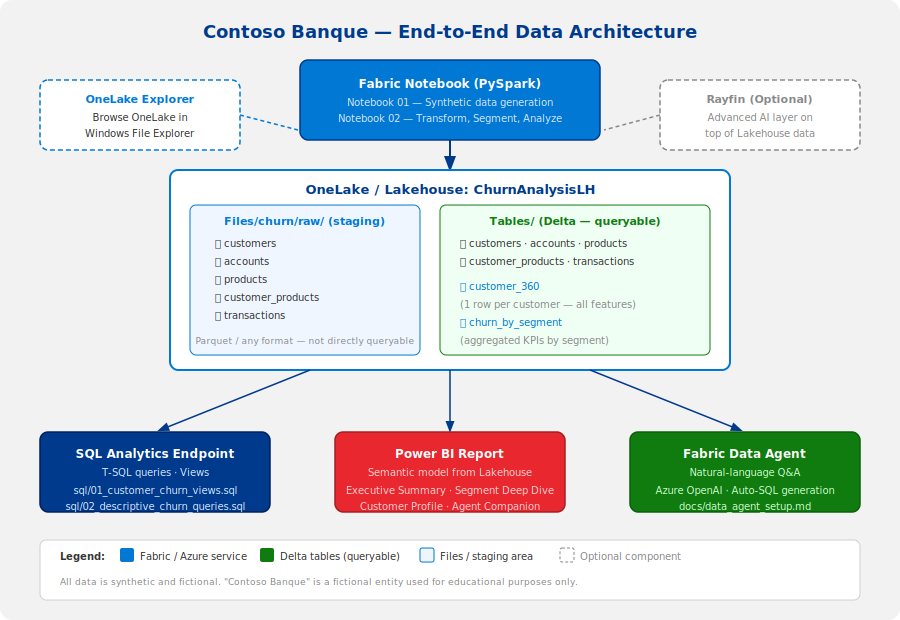
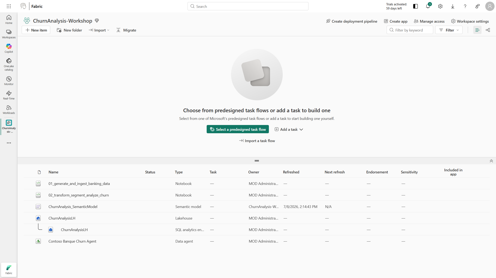
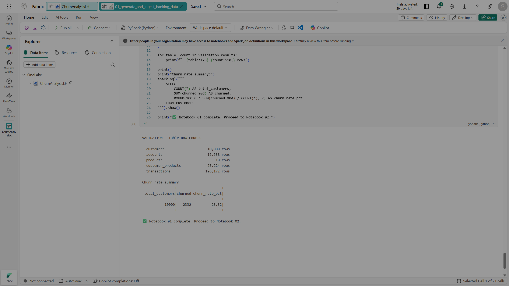
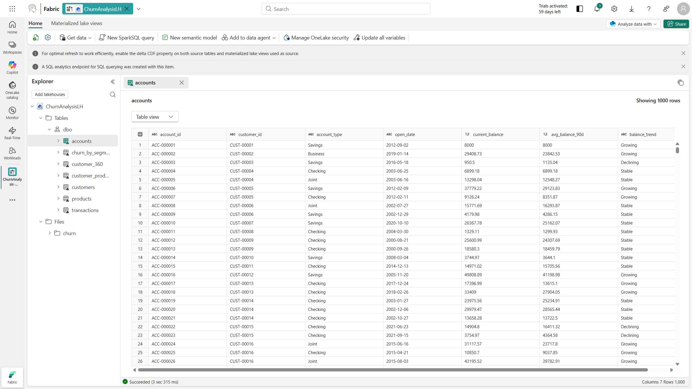
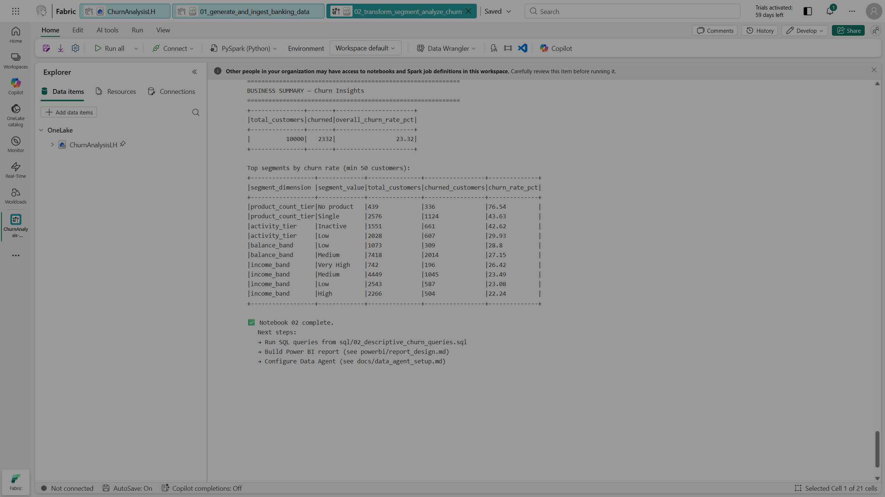
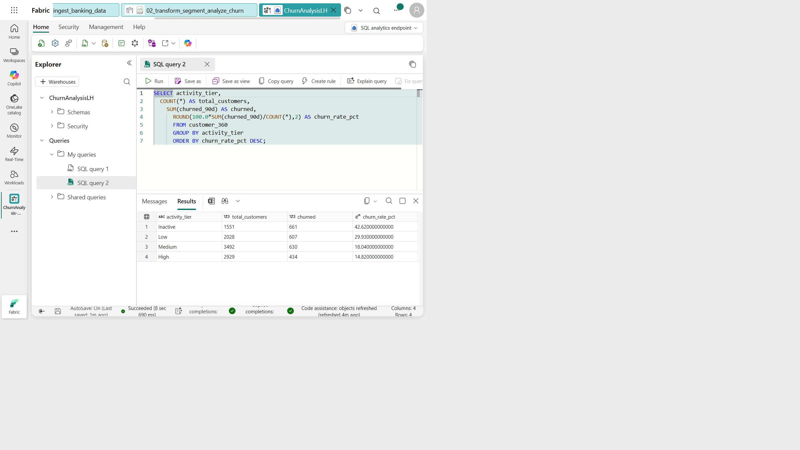
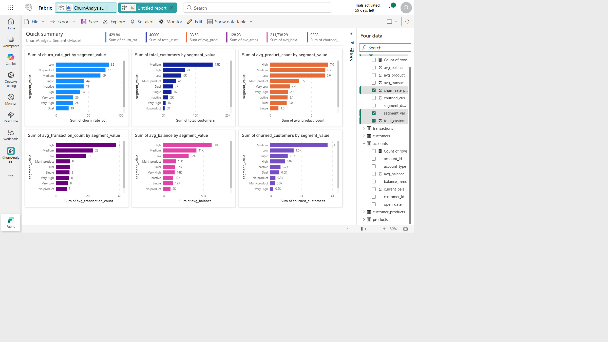
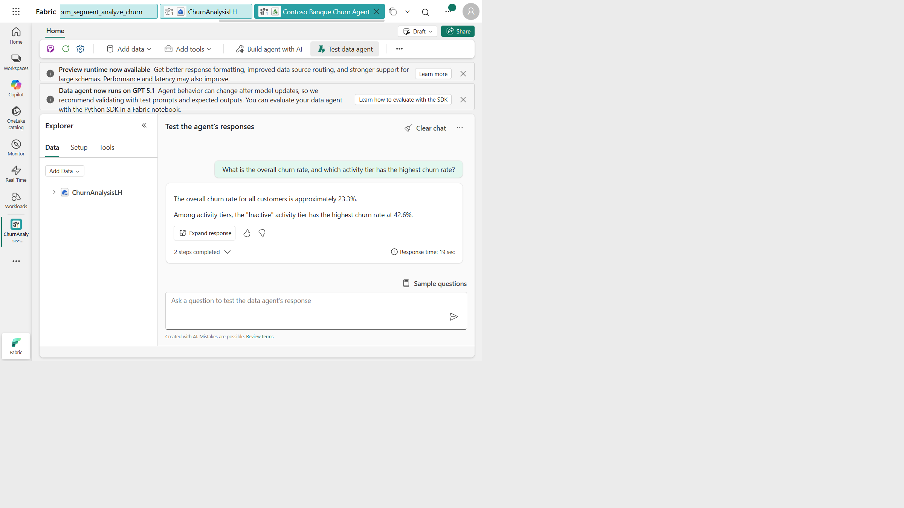

# Customer Churn Analysis — Microsoft Fabric Workshop

> **Fictional scenario — Contoso Banque**
> All data, customer names, account numbers, and figures used in this workshop are entirely synthetic and fictional. They do not represent any real bank, customer, or financial institution. "Contoso Banque" is a fictional entity used for educational purposes only.

---

## Table of Contents

1. [Workshop Overview](#1-workshop-overview)
2. [Target Audience](#2-target-audience)
3. [Learning Objectives](#3-learning-objectives)
4. [Prerequisites](#4-prerequisites)
5. [Workshop Flow and Timing](#5-workshop-flow-and-timing)
6. [Repository Structure](#6-repository-structure)
7. [Architecture](#7-architecture)
8. [Step 1 — Create the Fabric Workspace and Lakehouse](#step-1--create-the-fabric-workspace-and-lakehouse)
9. [Step 2 — Install and Configure OneLake Explorer](#step-2--install-and-configure-onelake-explorer)
10. [Step 3 — Explore OneLake Navigation](#step-3--explore-onelake-navigation)
11. [Step 3.4 — Upload Custom Segmentation CSV](#step-34--upload-custom-segmentation-csv)
12. [Step 4 — Generate Synthetic Banking Data](#step-4--generate-synthetic-banking-data)
13. [Step 5 — Transform, Segment, and Analyze Churn](#step-5--transform-segment-and-analyze-churn)
14. [Step 6 — SQL Analytics Endpoint](#step-6--sql-analytics-endpoint)
15. [Step 7 — Power BI Visualization](#step-7--power-bi-visualization)
16. [Step 8 — Fabric Data Agent](#step-8--fabric-data-agent)
17. [Step 9 — Optional: Rayfin Bonus](#step-9--optional-rayfin-bonus)
18. [Reference Links](#reference-links)

---

## 1. Workshop Overview

Welcome to the **Contoso Banque Customer Churn Analysis** workshop, a hands-on lab built entirely on **Microsoft Fabric**.

### Business Scenario

**Contoso Banque** is a fictional European retail bank with roughly 2 million retail customers. The Analytics team has been asked by the Chief Data Officer to understand which customer segments are most at risk of churning — that is, closing their accounts or stopping product usage within the next 90 days.

This workshop is **descriptive, not predictive**. You will not build a machine-learning model. Instead, you will:
- Generate realistic synthetic banking data.
- Clean and enrich it into a customer 360-degree view.
- Segment customers by activity, balance, and product usage.
- Calculate churn rates and KPIs by segment.
- Visualize insights in Power BI.
- Ask business questions in plain English using a **Fabric Data Agent**.

> **Why descriptive first?** Before building predictive models, data teams need a trusted, well-understood analytical foundation. This workshop gives you exactly that.

### What You Will Build

By the end of this workshop, you will have deployed an end-to-end analytical solution:

```
Synthetic data generation
        ↓
Fabric Lakehouse (OneLake)
        ↓
Curated Delta tables (customer_360, churn_by_segment)
        ↓
Power BI Report  +  Fabric Data Agent
```

### Key Concepts

| Concept | What it means in this workshop |
|---|---|
| **Churn** | A customer flagged as having closed accounts or stopped product activity in the last 90 days |
| **Segment** | A group of customers sharing similar activity, balance, or product-usage characteristics |
| **Delta table** | A versioned, queryable table stored in OneLake, readable by Spark, SQL, Power BI, and Data Agent |
| **Synthetic label** | The `churned_90d` flag is generated by business heuristics, not real data — used for learning only |

---

## 2. Target Audience

This workshop is designed for:

- **Beginner data analysts** who want to learn Microsoft Fabric end-to-end.
- **Data engineers** new to Fabric who want to understand the lakehouse pattern.
- **Solution engineers** demonstrating Fabric capabilities in a banking context.
- **Business users and power users** exploring self-service analytics in Fabric.

No prior experience with Microsoft Fabric is required. Basic familiarity with notebooks (any language) is helpful but not mandatory.

---

## 3. Learning Objectives

By the end of this workshop, you will be able to:

- [ ] Navigate OneLake and understand the difference between **Files** and **Tables**.
- [ ] Use **OneLake Explorer** to inspect Fabric data directly in Windows File Explorer.
- [ ] **Upload a CSV file** to a Lakehouse via OneLake Explorer and register it as a Delta table using "Load to Tables".
- [ ] Use a **Fabric Notebook** with PySpark to generate and ingest data into a Lakehouse.
- [ ] Save **Delta tables** to a Fabric Lakehouse.
- [ ] Transform raw banking data into customer-level analytical features.
- [ ] Apply **segmentation logic** based on activity, balance, and product count.
- [ ] Calculate **churn KPIs** (churn rate, churned count) by segment.
- [ ] Build a **Power BI report** directly from Fabric Lakehouse data.
- [ ] Configure a **Fabric Data Agent** and ask business questions in natural language.
- [ ] Understand where **Rayfin** could fit as an advanced bonus capability.

---

## 4. Prerequisites

### Required

| Prerequisite | Details |
|---|---|
| Microsoft Fabric access | Fabric must be enabled for your organization. You need a workspace with a Fabric capacity (F-SKU or P-SKU) assigned. |
| Ability to create Fabric items | You must be able to create Lakehouse, Notebook, Semantic Model / Power BI report, and Data Agent items in your workspace. |
| Power BI / Fabric account | Sign in with your organizational account (work or school account). |
| Windows 10 or 11 | Required for **OneLake file explorer** (Step 2). |
| OneLake file explorer installed | Download from the Microsoft store or official docs. Sign in with the same account used for Fabric. |
| Recommended browser | Microsoft Edge (other modern browsers work too). |

### For the Data Agent (Step 8)

- Your **tenant admin** must have enabled the **Fabric Data Agent** feature flag (check Fabric Admin Portal > Tenant Settings > Copilot and Azure OpenAI Settings).
- You must have **read access** to the Lakehouse or semantic model you want to use as a data source.
- Data Agent may not be available in all regions or capacity SKUs at the time of this workshop — check the [Fabric roadmap](https://aka.ms/fabricroadmap) for availability.

### For Rayfin (Optional — Step 9)

- **Node.js 18+** and **npm** installed on your machine.
- This section is entirely optional and depends on feature availability in your tenant/region.

### Not Required

- Python installed locally (all code runs in Fabric notebooks).
- Azure subscription (Fabric is a SaaS product).
- Any local data files (data is generated in the notebook).

---

## 5. Workshop Flow and Timing

| # | Module | Topic | Approx. Time | Output |
|---|---|---|---|---|
| 1 | Setup | Create Fabric workspace and Lakehouse | 15 min | `ChurnAnalysisLH` Lakehouse exists |
| 2 | OneLake Explorer | Install, configure, and explore OneLake | 20 min | Workspace visible in Windows File Explorer |
| 3 | OneLake Navigation | Understand Files vs Tables, mini exercise | 10 min | `hello-onelake.txt` visible in Fabric |
| 3.4 | Custom Segmentation | Upload CSV via OneLake Explorer, load as Delta table | 10 min | `customer_custom_segment` table in Lakehouse |
| 4 | Data Generation | Run notebook 01 — generate and ingest synthetic data | 30 min | 5 raw Delta tables in Lakehouse |
| 5 | Transformation | Run notebook 02 — build `customer_360` and `churn_by_segment` | 25 min | 2 curated analytical tables |
| 6 | SQL Analytics | Write and run descriptive SQL queries + custom segment cross-analysis | 20 min | Query results confirming churn KPIs by segment |
| 7 | Power BI | Build report from Lakehouse data | 25 min | Interactive churn dashboard |
| 8 | Data Agent | Configure agent, ask 5+ business questions incl. custom segments | 20 min | Natural-language answers from data |
| — | **Total core** | | **~2h 55min** | |
| 9 | Rayfin (bonus) | Explore Rayfin as advanced AI layer | 30–45 min | Rayfin connected to Lakehouse (optional) |

---

## 6. Repository Structure

```
churn-analysis/
├── README.md                          ← This file — the main workshop guide
├── requirements.txt                   ← Python dependencies for local dev/CI
│
├── notebooks/
│   ├── 01_generate_and_ingest_banking_data.ipynb   ← Generate synthetic data & write Delta tables
│   ├── 02_transform_segment_analyze_churn.ipynb    ← Build customer_360 & churn_by_segment
│   └── 03_data_agent_validation_questions.md       ← Sample questions for the Data Agent
│
├── sql/
│   ├── 01_customer_churn_views.sql    ← Create SQL views for churn analysis
│   ├── 02_descriptive_churn_queries.sql ← Descriptive KPI queries by segment
│   └── 03_custom_segment_queries.sql  ← Cross-analysis with custom segmentation table
│
├── powerbi/
│   ├── report_design.md              ← Power BI report design guide (pages, visuals, measures)
│   └── contoso_banque_theme.json     ← Custom Power BI theme (colors, fonts, card styles)
│
├── docs/
│   ├── onelake_explorer_setup.md     ← Detailed OneLake Explorer setup and troubleshooting
│   ├── data_agent_setup.md           ← Step-by-step Data Agent configuration guide
│   └── rayfin_optional.md            ← Optional Rayfin bonus instructions
│
├── data/
│   ├── README.md                     ← Explains the data model and schema
│   └── customer_custom_segment.csv   ← Custom business segmentation (10,000 rows — upload via OneLake Explorer)
│
├── assets/
│   ├── README.md                     ← Asset guide — screenshots and diagram instructions
│   ├── architecture_diagram.svg      ← Visual end-to-end architecture diagram
│   ├── 01_workspace_overview.svg     ← Placeholder — replace with real screenshot
│   ├── 02_lakehouse_tables.svg       ← Placeholder — replace with real screenshot
│   ├── 03_onelake_explorer.svg       ← Placeholder — replace with real screenshot
│   ├── 04_notebook_01_run_all.svg    ← Placeholder — replace with real screenshot
│   ├── 05_notebook_02_run_all.svg    ← Placeholder — replace with real screenshot
│   ├── 06_sql_endpoint_query.svg     ← Placeholder — replace with real screenshot
│   ├── 07_powerbi_report.svg         ← Placeholder — replace with real screenshot
│   ├── 08_data_agent_question.svg    ← Placeholder — replace with real screenshot
│   └── 09_onelake_raw_files.svg      ← Placeholder — replace with real screenshot
│
└── .github/
    └── workflows/
        └── validate.yml              ← CI: validates notebooks, JSON assets, SQL files, CSV
```

### Folder Purposes

| Folder | Purpose |
|---|---|
| `notebooks/` | Fabric notebooks (`.ipynb`) ready to import into your Fabric workspace |
| `sql/` | SQL scripts to run in the **SQL analytics endpoint** of your Lakehouse |
| `powerbi/` | Guidance on building the Power BI report |
| `docs/` | Deep-dive setup guides for specific Fabric features |
| `data/` | Schema documentation — no real data is stored here |
| `assets/` | Screenshots and diagrams to illustrate the workshop steps |

---

## 7. Architecture

### End-to-End Data Flow

```
┌─────────────────────────────────────────┐
│  Fabric Notebook (PySpark)              │
│  Synthetic banking data generation      │
│  notebook: 01_generate_and_ingest...    │
└──────────────┬──────────────────────────┘
               │
               ▼
┌─────────────────────────────────────────┐
│  OneLake / Lakehouse: ChurnAnalysisLH   │
│                                         │
│  Files/churn/raw/                       │
│    ├── customers  (Parquet/Delta)       │
│    ├── accounts                         │
│    ├── products                         │
│    ├── customer_products                │
│    └── transactions                     │
│                                         │
│  Tables/  (Delta tables)                │
│    ├── customers                        │
│    ├── accounts                         │
│    ├── products                         │
│    ├── customer_products                │
│    ├── transactions                     │
│    ├── customer_360     ◄── notebook 02 │
│    ├── churn_by_segment ◄── notebook 02 │
│    └── customer_custom_segment ◄── OneLake Explorer upload │
└────────┬─────────────────────────────────┘
         │
         ├──────────────────────────────────►  SQL Analytics Endpoint
         │                                     (sql/ scripts)
         │
         ├──────────────────────────────────►  Power BI Semantic Model
         │                                     (powerbi/ guide)
         │
         └──────────────────────────────────►  Fabric Data Agent
                                               (docs/data_agent_setup.md)
```



### Files vs Tables — Beginner Explanation

One of the most important concepts in a Fabric Lakehouse is the distinction between **Files** and **Tables**.

| | Files | Tables |
|---|---|---|
| **Location in OneLake** | `Files/` section | `Tables/` section |
| **Format** | Any format (CSV, Parquet, JSON, Delta…) | Always Delta format |
| **Queryable by SQL?** | ❌ No | ✅ Yes — via SQL analytics endpoint |
| **Queryable by Power BI?** | ❌ No (directly) | ✅ Yes — shows up in semantic model |
| **Readable by Spark?** | ✅ Yes (read manually) | ✅ Yes (as `spark.read.table(...)`) |
| **Used for** | Raw ingestion staging area | Curated, production-ready data |
| **Analogy** | A shared network drive | A database table |

**In this workshop:** Raw generated data is written first to `Files/churn/raw/` (staging), then also saved as proper Delta tables under `Tables/` so that Power BI and the Data Agent can query them directly.

---

## Step 1 — Create the Fabric Workspace and Lakehouse

### 1.1 Open Microsoft Fabric

1. Open your browser and navigate to [https://app.fabric.microsoft.com](https://app.fabric.microsoft.com).
2. Sign in with your organizational account.
3. On the home screen, confirm you see the **Microsoft Fabric** experience switcher (bottom-left icon).

### 1.2 Create or Select a Workspace

1. In the left navigation panel, click **Workspaces**.
2. Either select an existing workspace or click **+ New workspace**.
3. Give it a name such as `ChurnAnalysis-Workshop` or `ChurnAnalysis-[YourInitials]`.
4. In the workspace settings (gear icon), confirm that a **Fabric capacity** (not just Power BI Premium) is assigned. You will see "Trial", "Fabric capacity", or a capacity name. If it says "Pro" only, some Fabric features may not be available.

> **Tip:** If you are using a Fabric trial, you get 60 days of F64-equivalent capacity. This is sufficient for this workshop.

### 1.3 Create the Lakehouse

1. Inside your workspace, click **+ New item**.
2. Search for or select **Lakehouse**.
3. Name it exactly: **`ChurnAnalysisLH`**
4. Click **Create**.

You should now see the Lakehouse page with an empty **Files** section and an empty **Tables** section.

### 1.4 Create and Attach Notebooks

1. In your workspace, click **+ New item** → **Notebook**.
2. Name the first notebook: `01 - Generate and Ingest Banking Data`.
3. In the notebook, click **Add Lakehouse** in the Explorer pane on the left.
4. Select **Existing Lakehouse** → choose `ChurnAnalysisLH` → click **Add**.
5. Repeat steps 1–4 to create a second notebook: `02 - Transform Segment Analyze Churn`.

### 1.5 Validate

**Expected output after this step:**
- A Lakehouse named `ChurnAnalysisLH` is visible in your workspace.
- Both notebooks show `ChurnAnalysisLH` in their Explorer pane.
- The Lakehouse has empty Files and Tables sections.

> 📸 **Live run — workspace overview.** The `ChurnAnalysis-Workshop` workspace on the `sales` capacity, showing the Lakehouse, both notebooks, the semantic model, and the Data Agent created during this workshop.
>
> 

---

## Step 2 — Install and Configure OneLake Explorer

> 📄 **Full guide:** [`docs/onelake_explorer_setup.md`](docs/onelake_explorer_setup.md)

OneLake Explorer is a Windows application that lets you browse and interact with OneLake data directly from **Windows File Explorer** — just like browsing a network share.

### 2.1 Download and Install

1. Open the [OneLake file explorer download page](https://aka.ms/OneLakeExplorer) or search for "Microsoft OneLake" in the **Microsoft Store**.
2. Download and install the application.
3. After installation, OneLake file explorer will appear in the system tray (bottom-right of the taskbar).

For detailed setup and troubleshooting, see [`docs/onelake_explorer_setup.md`](docs/onelake_explorer_setup.md) and the [official OneLake file explorer documentation (FR)](https://learn.microsoft.com/fr-fr/fabric/onelake/onelake-file-explorer).

### 2.2 Sign In

1. Click the OneLake icon in the system tray.
2. Click **Sign in**.
3. Use the **same organizational account** you used to sign in to Fabric. If you use a different account, your workspaces will not appear.

### 2.3 Open Windows File Explorer

1. Press `Windows + E` to open File Explorer.
2. In the left navigation panel, look for **OneLake - Microsoft** (or a similar label showing your organization).
3. You should see a folder for your tenant.

### 2.4 Navigate to Your Workspace

1. Open the `OneLake - Microsoft` folder.
2. Find your workspace: `ChurnAnalysis-Workshop` (or the name you chose).
3. Open it and look for `ChurnAnalysisLH.Lakehouse`.
4. Inside, you will see `Files` and `Tables` sub-folders.

> **Important — Placeholder files vs. downloaded files:**
> OneLake Explorer uses "placeholder" (cloud-only) files by default. A file may appear in Explorer but the actual bytes are not downloaded to your machine until you open or double-click it. You will see a small cloud icon on files that are not yet locally available.
> To download: double-click the file, or right-click → **Always keep on this device**.

### 2.5 Sync from OneLake

After running the data notebooks, OneLake Explorer may not immediately show new files. To refresh:
1. Right-click on the workspace or lakehouse folder.
2. Select **Sync from OneLake**.

### 2.6 Basic Troubleshooting

| Problem | Solution |
|---|---|
| Workspace not visible | Ensure you signed in with the same account used in Fabric. Try signing out and back in from the system tray icon. |
| Wrong account | Sign out of OneLake Explorer (system tray → Sign out), then sign in with the correct account. |
| Sync delay | New files created in Fabric may take 1–5 minutes to appear in Explorer. Use "Sync from OneLake". |
| Windows reserved characters | File or folder names with characters like `?`, `*`, `:`, `<`, `>` will not sync. Fabric creates safe names automatically. |
| Feature disabled | If OneLake Explorer is blocked, ask your tenant admin to enable "OneLake file explorer" in the Fabric Admin Portal. |

### 2.7 Validation

After completing this step:
- You can see `ChurnAnalysisLH.Lakehouse` in Windows File Explorer.
- You can see the `Files` and `Tables` sub-folders.
- After running notebook 01 (Step 4), you will return here and verify `Files/churn/raw` is visible.

---

## Step 3 — Explore OneLake Navigation

### 3.1 Understanding the Folder Structure

When you open your Lakehouse in OneLake Explorer, you see:

```
ChurnAnalysisLH.Lakehouse/
├── Files/          ← Raw and staged file storage (any format)
│   └── churn/
│       └── raw/    ← Will be created by notebook 01
└── Tables/         ← Delta tables (queryable by SQL, Power BI, Data Agent)
    ├── customers
    ├── accounts
    └── ...
```

### 3.2 Why This Structure?

| Folder | Why we use it |
|---|---|
| `Files/churn/raw/` | Raw staging area — data land here first, before transformation |
| `Tables/` | Curated, validated, production-ready Delta tables |

Think of it like a factory:
- **Files** = the loading dock where raw materials arrive.
- **Tables** = the finished goods warehouse, ready for delivery (to Power BI, SQL, Data Agent).

### 3.3 Mini Exercise — Hello OneLake

This exercise verifies that your OneLake Explorer connection is working correctly.

1. In Windows File Explorer, navigate to: `ChurnAnalysisLH.Lakehouse / Files /`
2. Right-click → New → Text Document.
3. Name it `hello-onelake.txt`.
4. Open it and type: `Hello from OneLake Explorer!`
5. Save and close the file.
6. Wait 1–2 minutes, then open the [Fabric portal](https://app.fabric.microsoft.com) and navigate to your Lakehouse.
7. Confirm that `hello-onelake.txt` appears in the **Files** section.
8. Delete the file from the Fabric portal (right-click → Delete) to keep things clean.

> **Note:** Writing directly to `Tables/` from your local machine is not recommended. Always use Spark (notebook) to write Delta tables.

---

## Step 3.4 — Upload Custom Segmentation CSV

> 📄 **Full instructions:** [`docs/onelake_explorer_setup.md`](docs/onelake_explorer_setup.md#uploading-a-custom-segmentation-file)
> 📂 **File to upload:** [`data/customer_custom_segment.csv`](data/customer_custom_segment.csv)

This step shows how to use OneLake Explorer to upload an **external enrichment file** and register it as a Delta table — all without writing a single line of code.

The file `data/customer_custom_segment.csv` provides a custom business segmentation for all 10,000 synthetic customers:

| Segment | Description | ~Count |
|---|---|---|
| `VIP` | High-value customers prioritised for premium service | 990 |
| `Loyal` | Long-standing customers with stable engagement | 3,000 |
| `At Risk` | Customers flagged by the business team as potentially churning | 1,960 |
| `New Joiner` | Recently acquired customers | 1,580 |
| `Dormant` | Customers with very low or no recent activity | 2,460 |

### 3.4.1 Download and Upload

1. Download `data/customer_custom_segment.csv` from this repository to your local machine.
2. In Windows File Explorer, navigate to `ChurnAnalysisLH.Lakehouse / Files /`.
3. Create a sub-folder named `upload` inside `Files/`.
4. **Drag and drop** `customer_custom_segment.csv` into `Files/upload/`.
5. Wait for the sync icon to stop spinning, then verify in the Fabric portal that the file appears.

### 3.4.2 Load as a Delta Table

1. In the Fabric portal Lakehouse view, go to `Files / upload /`.
2. Right-click `customer_custom_segment.csv` → **Load to Tables** → **New table**.
3. Set the table name to `customer_custom_segment`, confirm headers are detected, and click **Load**.
4. Wait 30–60 seconds. Refresh **Tables** — `customer_custom_segment` should appear.

### 3.4.3 Quick Validation

In the SQL analytics endpoint:
```sql
SELECT COUNT(*) AS total_rows FROM customer_custom_segment;
```
Expected: 10,000.

> **When to do this step:** The upload can be done at any point in the workshop. The join queries that cross-reference this table with `customer_360` are in Step 6.

---

## Step 4 — Generate Synthetic Banking Data

> 📓 **Notebook:** [`notebooks/01_generate_and_ingest_banking_data.ipynb`](notebooks/01_generate_and_ingest_banking_data.ipynb)

### 4.1 Import the Notebook into Fabric

1. In your Fabric workspace, click **+ New item** → **Import notebook**.
2. Upload `notebooks/01_generate_and_ingest_banking_data.ipynb` from this repository.
3. After import, open the notebook and confirm that `ChurnAnalysisLH` is attached in the Explorer pane. If not, click **Add Lakehouse** and attach it.

### 4.2 What the Notebook Does

The notebook generates five synthetic datasets representing a realistic European retail bank:

| Dataset | Rows | Description |
|---|---|---|
| `customers` | 10,000 | One row per customer: demographics, tenure, risk profile, digital activity, churn label |
| `accounts` | ~15,000 | One row per bank account: balances, account type, trends |
| `products` | 10 | Product catalogue: savings accounts, credit cards, loans, insurance, etc. |
| `customer_products` | ~30,000 | Which products each customer holds |
| `transactions` | ~175,000 | Individual transactions: amounts, channels, merchant categories |

### 4.3 The Churn Label

The `churned_90d` flag on the `customers` table is generated using **transparent business heuristics**:

```
Higher churn probability if:
  → Low transaction count in last 90 days (low activity)
  → Declining account balance trend
  → Only 1 active product (low product depth)
  → Not digitally active (digital_active_flag = 0)
  → Age > 70 (proxy for vulnerability / exit risk)

Lower churn probability if:
  → Multiple products active
  → Digital active + high transaction volume
  → Growing balance trend
```

This label is **entirely synthetic**. It does not reflect any real customer behavior and is designed purely to enable meaningful descriptive analysis in this workshop.

### 4.4 Key PySpark Snippets

Here are the key patterns used in the notebook. Run the full notebook for complete executable code.

**Generate customers with PySpark:**
```python
from pyspark.sql import SparkSession
from pyspark.sql.functions import *
from pyspark.sql.types import *
import random

spark = SparkSession.builder.getOrCreate()

# Reproducible seed
random.seed(42)

# Customer data is generated as a Python list, then converted to a Spark DataFrame
# See the notebook for the full generator function
customers_df = spark.createDataFrame(customers_data, schema=customer_schema)
```

**Write to Files (raw staging):**
```python
customers_df.write.mode("overwrite").parquet(
    "Files/churn/raw/customers"
)
```

**Write as Delta table:**
```python
customers_df.write.format("delta").mode("overwrite").saveAsTable("customers")
```

**Verify the table exists:**
```python
spark.sql("SELECT COUNT(*) AS total_customers FROM customers").show()
```

### 4.5 Run the Notebook

1. Click **Run all** in the notebook toolbar.
2. The notebook will take approximately 3–8 minutes to complete (depending on your capacity SKU).
3. After completion, verify:
   - In the **Lakehouse Explorer** (left pane): `Tables/` shows 5 new tables.
   - In the **Lakehouse Files** section: `Files/churn/raw/` shows 5 sub-folders.

### 4.6 Validate in OneLake Explorer

1. In Windows File Explorer, navigate to your Lakehouse in OneLake Explorer.
2. Right-click → **Sync from OneLake**.
3. Confirm `Files/churn/raw/customers/` is visible.

> 📸 **Live run — notebook 01 complete.** After **Run all**, the final cell confirms the generated volumes: 10,000 customers, 15,538 accounts, 10 products, 23,224 customer-products, and 196,172 transactions, with an overall churn rate of **23.32%**.
>
> 
>
> The five raw Delta tables then appear in the Lakehouse **Tables** section:
>
> 

---

## Step 5 — Transform, Segment, and Analyze Churn

> 📓 **Notebook:** [`notebooks/02_transform_segment_analyze_churn.ipynb`](notebooks/02_transform_segment_analyze_churn.ipynb)

### 5.1 Import and Attach the Notebook

1. Import `notebooks/02_transform_segment_analyze_churn.ipynb` into your Fabric workspace.
2. Attach `ChurnAnalysisLH` as the Lakehouse.

### 5.2 What This Notebook Does

This notebook reads the 5 raw Delta tables, joins and enriches them, and produces two curated analytical tables:

| Output Table | Description |
|---|---|
| `customer_360` | One row per customer — all features combined: demographics, balance metrics, product count, transaction activity, churn label |
| `churn_by_segment` | Aggregated churn KPIs grouped by segment (activity tier, balance band, product count tier, income band) |

### 5.3 Segmentation Logic

```
Activity Tier (based on transaction count last 90 days):
  → "High"    : ≥ 10 transactions
  → "Medium"  : 4–9 transactions
  → "Low"     : 1–3 transactions
  → "Inactive": 0 transactions

Balance Band (based on avg_balance_90d):
  → "High"    : ≥ €25,000
  → "Medium"  : €5,000–€24,999
  → "Low"     : €500–€4,999
  → "Very Low": < €500

Product Count Tier:
  → "Multi-product" : ≥ 3 active products
  → "Dual"          : 2 active products
  → "Single"        : 1 active product
  → "No product"    : 0 active products
```

### 5.4 Key Churn KPIs

After running the notebook, `churn_by_segment` contains:

| Column | Description |
|---|---|
| `segment_dimension` | Which segmentation axis (e.g., "activity_tier") |
| `segment_value` | Segment label (e.g., "Inactive") |
| `total_customers` | Number of customers in this segment |
| `churned_customers` | Number flagged as churned |
| `churn_rate_pct` | `churned_customers / total_customers × 100` |
| `avg_balance` | Average balance across the segment |
| `avg_product_count` | Average number of active products |

### 5.5 Run the Notebook

1. Click **Run all**.
2. After completion, verify that `customer_360` and `churn_by_segment` appear in `Tables/`.

> 📸 **Live run — notebook 02 complete.** The transformation notebook builds the curated `customer_360` and `churn_by_segment` tables after a successful **Run all**.
>
> 

---

## Step 6 — SQL Analytics Endpoint

> 📄 **SQL scripts:** [`sql/01_customer_churn_views.sql`](sql/01_customer_churn_views.sql) and [`sql/02_descriptive_churn_queries.sql`](sql/02_descriptive_churn_queries.sql)

Every Fabric Lakehouse automatically comes with a **SQL analytics endpoint** — a read-only serverless SQL layer that lets you query your Delta tables using standard T-SQL.

### 6.1 Access the SQL Analytics Endpoint

1. In your Lakehouse, click the **SQL analytics endpoint** button (top-right of the Lakehouse page, or switch the experience to "SQL analytics endpoint" using the dropdown).
2. You will see a SQL query editor, and your Delta tables listed in the left pane.

### 6.2 Create Views

Copy and run the SQL from [`sql/01_customer_churn_views.sql`](sql/01_customer_churn_views.sql) to create helper views.

Key view example:
```sql
CREATE VIEW vw_churn_by_activity AS
SELECT
    activity_tier,
    COUNT(*) AS total_customers,
    SUM(churned_90d) AS churned_customers,
    ROUND(100.0 * SUM(churned_90d) / COUNT(*), 2) AS churn_rate_pct,
    ROUND(AVG(avg_balance_90d), 2) AS avg_balance
FROM customer_360
GROUP BY activity_tier
ORDER BY churn_rate_pct DESC;
```

### 6.3 Run Descriptive Queries

Copy and run the queries from [`sql/02_descriptive_churn_queries.sql`](sql/02_descriptive_churn_queries.sql) to explore churn patterns.

Example queries include:
- Churn rate by activity tier
- Churn rate by balance band
- Churn rate by number of products held
- Churn rate by income band and digital activity
- Top 10 merchant categories for churned vs. retained customers

### 6.4 Cross-Analyse with Custom Segmentation

After completing Step 3.4 (uploading `customer_custom_segment`), run the queries from [`sql/03_custom_segment_queries.sql`](sql/03_custom_segment_queries.sql) to cross-reference the business-defined segments with the analytical data.

Key queries include:
- Churn rate by custom segment (JOIN `customer_custom_segment` with `customer_360`)
- Custom segment × activity tier cross-tab
- Full profile card per custom segment
- Churn delta vs. baseline for each segment

### 6.5 Validate

**Expected output:**
- Inactive customers show the highest churn rate (> 40%).
- Single-product customers show materially higher churn than multi-product customers.
- Digitally inactive customers show higher churn than digitally active customers.
- The custom segment cross-analysis reveals which business-defined groups overlap most with high-churn internal segments.

> 📸 **Live run — SQL analytics endpoint.** A descriptive churn query executed against the auto-provisioned SQL endpoint of `ChurnAnalysisLH`, returning churn KPIs by segment.
>
> 

---

## Step 7 — Power BI Visualization

> 📄 **Report guide:** [`powerbi/report_design.md`](powerbi/report_design.md)

### 7.1 Create a Semantic Model

1. In your Lakehouse, click the **New semantic model** button.
2. Select these tables to include: `customer_360`, `churn_by_segment`, `customers`, `accounts`, `customer_custom_segment`.
3. Click **Confirm** — Fabric will auto-generate the semantic model.

### 7.2 Define Relationships Between Tables

When Fabric generates the semantic model it auto-detects **some** relationships, but you should open the **model view** and verify (or create) them so that cross-table filtering, slicers, and the Data Agent joins all work correctly.

1. Open the semantic model and switch to the **Model** view (the diagram/layout view) — each table appears as a card listing its columns.
2. To create a relationship, **drag a key column from one table onto the matching key column of the other**, or use **Home → Manage relationships → + New relationship**.
3. Create the following relationships:

| From (many side) | Column | To (one side) | Column | Cardinality | Cross-filter |
|---|---|---|---|---|---|
| `accounts` | `customer_id` | `customers` | `customer_id` | Many-to-one (\*:1) | Single |
| `customer_products` | `customer_id` | `customers` | `customer_id` | Many-to-one (\*:1) | Single |
| `customer_products` | `product_id` | `products` | `product_id` | Many-to-one (\*:1) | Single |
| `transactions` | `account_id` | `accounts` | `account_id` | Many-to-one (\*:1) | Single |
| `transactions` | `customer_id` | `customers` | `customer_id` | Many-to-one (\*:1) | Single — keep **inactive** (see note) |
| `customer_360` | `customer_id` | `customers` | `customer_id` | One-to-one (1:1) | Both |
| `customer_custom_segment` | `customer_id` | `customers` | `customer_id` | One-to-one (1:1) | Both |

4. For each relationship, confirm the **cardinality** and **cross-filter direction** in the dialog, then click **OK / Save**.

> **Notes:**
> - `churn_by_segment` is a **pre-aggregated summary table** with no shared key — leave it **standalone** and use it directly for segment KPI visuals.
> - The `transactions → customers` link is redundant with the `transactions → accounts → customers` path. Keep only one **active** path to avoid an ambiguous filter; Power BI marks the extra relationship **inactive** (dashed line) — that is expected.
> - Once relationships exist, a slicer on `customers` (e.g., `region`, `income_band`) or on `customer_custom_segment` (`custom_segment`) will correctly filter visuals built on `customer_360`, `accounts`, and `transactions`.

### 7.3 Open Power BI Report Builder

1. From the semantic model, click **Create a report** → **Auto-create report** (to get a starting point) or **Blank report** (to build from scratch).
2. Follow the guide in [`powerbi/report_design.md`](powerbi/report_design.md) for the recommended page layouts and visuals.

### 7.4 Key Visuals to Build

| Visual | Data | Purpose |
|---|---|---|
| KPI Card | Overall churn rate % | Executive summary |
| KPI Card | Total churned customers | Volume indicator |
| Bar chart | Churn rate by activity tier | Identify most at-risk activity segment |
| Bar chart | Churn rate by balance band | Balance vs. churn relationship |
| Bar chart | Churn rate by product count tier | Product depth impact |
| Bar chart | Churn rate by custom segment | Business segment overlay |
| Scatter plot | Avg balance vs. churn rate by segment | Quadrant analysis |
| Table | Top segments by churn rate | Detailed drill-through |
| Slicer | Income band | Filter for specific customer groups |
| Slicer | Region | Geographic filter |
| Slicer | Custom segment | Filter by business-defined segment |

### 7.5 Publish

When your report is ready, save it. It is automatically published to your Fabric workspace.

> 📸 **Live run — churn visualization.** A matrix built from `churn_by_segment` breaking down `churn_rate_pct`, `total_customers`, and `churned_customers` across each segmentation dimension.
>
> 
>
> ℹ️ **Note:** If your account has only a Power BI Pro/PPU-free profile, **Create report / Auto-create** may be disabled. In that case use **Explore this data** on the semantic model (as shown above) to build the same visuals interactively.

---

## Step 8 — Fabric Data Agent

> 📄 **Full setup guide:** [`docs/data_agent_setup.md`](docs/data_agent_setup.md)
> 💬 **Sample questions:** [`notebooks/03_data_agent_validation_questions.md`](notebooks/03_data_agent_validation_questions.md)

A **Fabric Data Agent** lets users ask questions about data in plain English, and Fabric generates the SQL query and returns the answer — no SQL knowledge required.

### 8.1 Create the Data Agent

1. In your Fabric workspace, click **+ New item** → search for **Data agent**.
2. Name it: `Contoso Banque Churn Agent`.
3. Click **Create**.

### 8.2 Configure Data Sources

1. In the Data Agent configuration panel, click **+ Add data source**.
2. Select **Lakehouse** → choose `ChurnAnalysisLH`.
3. Select the tables to include: `customer_360`, `churn_by_segment`, `customers`, `accounts`, `customer_custom_segment`.
4. Click **Save**.

### 8.3 Add Business Context Instructions

In the **Instructions** text box, paste the following context to help the agent answer banking questions correctly:

```
You are an analytics assistant for Contoso Banque, a fictional European retail bank.
The data contains synthetic customer records for a churn analysis workshop.
- 'churned_90d' = 1 means the customer is flagged as churned in the last 90 days.
- 'activity_tier' groups customers by transaction frequency.
- 'balance_band' groups customers by average balance.
- 'custom_segment' is a business label from customer_custom_segment table:
    "VIP", "Loyal", "At Risk", "New Joiner", "Dormant".
  To use it, JOIN customer_custom_segment ON customer_id with customer_360.
- All figures are in EUR. All data is fictional and used for learning purposes only.
```

### 8.4 Test the Agent

Use the sample questions from [`notebooks/03_data_agent_validation_questions.md`](notebooks/03_data_agent_validation_questions.md), for example:

1. *"What is the overall churn rate for Contoso Banque customers?"*
2. *"Which activity tier has the highest churn rate?"*
3. *"How many customers are single-product holders, and what is their churn rate?"*
4. *"Show me the top 3 segments by churn rate."*
5. *"What is the average balance of churned customers compared to retained customers?"*
6. *"What is the churn rate for each custom segment?"*
7. *"Which custom segment has the most 'At Risk' customers with an inactive activity tier?"*

### 8.5 Validate

**Expected behavior:**
- The agent returns a SQL query it generated, plus the answer.
- Results align with what you saw in your Power BI report and SQL queries.
- For custom segment questions, the agent correctly JOINs `customer_custom_segment` with `customer_360` on `customer_id`.

> 📸 **Live run — Data Agent answering in natural language.** The `Contoso Banque Churn Agent` correctly reports an overall churn rate of **~23.3%** and identifies the **Inactive** activity tier as the highest-risk segment (**~42.6%**).
>
> 

---

## Step 9 — Optional: Rayfin Bonus

> 📄 **Full guide:** [`docs/rayfin_optional.md`](docs/rayfin_optional.md)

> ⚠️ **This section is entirely optional.** It requires Node.js 18+, npm, and depends on Rayfin feature availability in your tenant/region. If Rayfin is not available or you are short on time, skip this section.

[Rayfin](https://aka.ms/rayfin) is a Microsoft-built open-source backend that enables semantic search and natural language data exploration on top of Fabric data. It can serve as an advanced AI layer on top of your Lakehouse.

See [`docs/rayfin_optional.md`](docs/rayfin_optional.md) for installation and configuration steps.

---

## Reference Links

| Resource | Link |
|---|---|
| Microsoft Fabric home | [https://app.fabric.microsoft.com](https://app.fabric.microsoft.com) |
| OneLake file explorer | [https://aka.ms/OneLakeExplorer](https://aka.ms/OneLakeExplorer) |
| OneLake file explorer documentation (FR) | [https://learn.microsoft.com/fr-fr/fabric/onelake/onelake-file-explorer](https://learn.microsoft.com/fr-fr/fabric/onelake/onelake-file-explorer) |
| Load data into Fabric Lakehouse notebooks | [https://learn.microsoft.com/fabric/data-engineering/lakehouse-notebook-load-data](https://learn.microsoft.com/fabric/data-engineering/lakehouse-notebook-load-data) |
| Microsoft Fabric churn prediction tutorial | [https://learn.microsoft.com/fabric/data-science/customer-churn](https://learn.microsoft.com/fabric/data-science/customer-churn) |
| Fabric Data Agent documentation | [https://learn.microsoft.com/fabric/data-science/data-agent-overview](https://learn.microsoft.com/fabric/data-science/data-agent-overview) |
| SQL analytics endpoint overview | [https://learn.microsoft.com/fabric/data-engineering/lakehouse-sql-analytics-endpoint](https://learn.microsoft.com/fabric/data-engineering/lakehouse-sql-analytics-endpoint) |
| Build Power BI reports in Fabric | [https://learn.microsoft.com/power-bi/create-reports/create-report-fabric](https://learn.microsoft.com/power-bi/create-reports/create-report-fabric) |
| Rayfin GitHub repository | [https://github.com/microsoft/rayfin](https://github.com/microsoft/rayfin) |
| Fabric Admin Portal — Tenant Settings | [https://learn.microsoft.com/fabric/admin/tenant-settings-index](https://learn.microsoft.com/fabric/admin/tenant-settings-index) |
| Fabric Lakehouse documentation | [https://learn.microsoft.com/fabric/data-engineering/lakehouse-overview](https://learn.microsoft.com/fabric/data-engineering/lakehouse-overview) |

---

> See the disclaimer at the top of this document.
